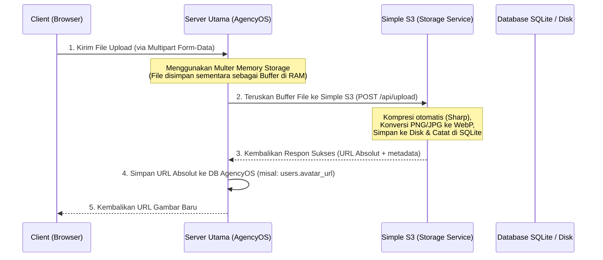

# Panduan Integrasi Simple S3 dengan Proyek Node.js/TypeScript (AgencyOS)

Dokumentasi ini menjelaskan langkah-langkah untuk menghubungkan dan menggunakan **Simple S3** sebagai service penyimpanan media utama pada aplikasi Anda (seperti **AgencyOS**).

---

## 1. Alur Kerja Integrasi



---

## 2. Persiapan API Key

Setiap request dari server utama Anda (AgencyOS) ke Simple S3 wajib menyertakan API Key pada header `x-api-key`.

### A. Mendapatkan API Key
1. Masuk ke Dasbor Admin Simple S3 Anda.
2. Buka tab **API Keys**, buat API Key baru, dan kaitkan dengan bucket target (misal: `default`).
3. Salin token API Key tersebut (format: `sk_client_...`).

> [!TIP]
> Jika Anda kehilangan Master API Key admin Anda, gunakan perintah CLI berikut di terminal Simple S3:
> * **Melihat seluruh key**: `bun run show-key`
> * **Mereset Master API Key**: `bun run reset-key`

---

## 3. Konfigurasi Environment Variables

Tambahkan baris berikut pada file `.env` di proyek **AgencyOS** Anda:

```env
# URL tempat Microservice Simple S3 berjalan
STORAGE_API_URL=https://storage.agencyos.com  # Gunakan domain/subdomain di Production!

# API Key Klien yang Anda salin dari Langkah 2
STORAGE_API_KEY=sk_client_8af89e95aa54875bd895027d30532530
```

---

## 4. Helper Integrasi TypeScript (`storageHelper.ts`)

Buat file helper di proyek AgencyOS Anda (misalnya di `src/utils/storageHelper.ts`) untuk menangani komunikasi HTTP HTTP dengan Simple S3.

> [!IMPORTANT]
> Jika AgencyOS menggunakan **Node.js v18+** atau **Bun**, Anda dapat langsung menggunakan `fetch` bawaan tanpa memerlukan package `node-fetch`.

```typescript
import FormData from 'form-data';
import fetch from 'node-fetch'; // Hapus ini jika menggunakan Bun / Node 18+

const STORAGE_API_URL = process.env.STORAGE_API_URL || 'http://localhost:3000';
const STORAGE_API_KEY = process.env.STORAGE_API_KEY || '';

interface UploadResult {
  success: boolean;
  url: string;        // URL publik absolut untuk diakses langsung
  filename: string;   // Nama berkas unik yang disimpan di server storage
  originalName: string;
  mimeType: string;
  size: number;
}

interface MultipleUploadResult {
  success: boolean;
  message: string;
  data: {
    url: string;
    filename: string;
    originalName: string;
    mimeType: string;
    size: number;
  }[];
}

/**
 * Mengunggah berkas tunggal ke Simple S3
 */
export async function uploadToInternalStorage(
  fileBuffer: Buffer,
  originalName: string,
  mimeType: string
): Promise<UploadResult> {
  const formData = new FormData();
  formData.append('file', fileBuffer, {
    filename: originalName,
    contentType: mimeType
  });

  try {
    const response = await fetch(`${STORAGE_API_URL}/api/upload`, {
      method: 'POST',
      headers: {
        'x-api-key': STORAGE_API_KEY,
        ...formData.getHeaders()
      },
      body: formData
    });

    const body = await response.json() as any;

    if (!response.ok || !body.success) {
      throw new Error(body.error || 'Gagal mengunggah berkas');
    }

    return {
      success: true,
      url: `${STORAGE_API_URL}${body.data.url}`,
      filename: body.data.filename,
      originalName: body.data.originalName,
      mimeType: body.data.mimeType,
      size: body.data.size
    };
  } catch (error: any) {
    console.error('[STORAGE SERVICE ERROR] Upload gagal:', error.message);
    throw error;
  }
}

/**
 * Mengunggah banyak berkas secara bersamaan (paralel)
 */
export async function uploadMultipleToInternalStorage(
  files: { buffer: Buffer; originalname: string; mimetype: string }[]
): Promise<MultipleUploadResult> {
  const formData = new FormData();

  files.forEach((file) => {
    formData.append('files', file.buffer, {
      filename: file.originalname,
      contentType: file.mimetype
    });
  });

  try {
    const response = await fetch(`${STORAGE_API_URL}/api/upload/multiple`, {
      method: 'POST',
      headers: {
        'x-api-key': STORAGE_API_KEY,
        ...formData.getHeaders()
      },
      body: formData
    });

    const body = await response.json() as any;

    if (!response.ok || !body.success) {
      throw new Error(body.error || 'Gagal mengunggah berkas ganda');
    }

    const formattedData = body.data.map((file: any) => ({
      ...file,
      url: `${STORAGE_API_URL}${file.url}`
    }));

    return {
      success: true,
      message: body.message,
      data: formattedData
    };
  } catch (error: any) {
    console.error('[STORAGE SERVICE ERROR] Upload ganda gagal:', error.message);
    throw error;
  }
}

/**
 * Menghapus berkas secara aman dari penyimpanan
 */
export async function deleteFromInternalStorage(filename: string): Promise<boolean> {
  try {
    const response = await fetch(`${STORAGE_API_URL}/api/file/${filename}`, {
      method: 'DELETE',
      headers: {
        'x-api-key': STORAGE_API_KEY
      }
    });

    const body = await response.json() as any;
    if (!response.ok || !body.success) {
      throw new Error(body.error || 'Gagal menghapus berkas');
    }

    return true;
  } catch (error: any) {
    console.error('[STORAGE SERVICE ERROR] Penghapusan gagal:', error.message);
    return false;
  }
}
```

---

## 5. Implementasi Controller di Express (Multer Memory Storage)

Untuk menerima file dari client di server AgencyOS, gunakan Multer dengan konfigurasi **Memory Storage** (agar tidak membuat sampah file lokal temporer di server AgencyOS).

```typescript
import { Request, Response } from 'express';
import multer from 'multer';
import { uploadToInternalStorage, deleteFromInternalStorage } from '../utils/storageHelper.js';

// Setup Multer ke Memory Storage
const uploadMiddleware = multer({
  storage: multer.memoryStorage(),
  limits: { fileSize: 50 * 1024 * 1024 } // 50MB
});

/**
 * Route Handler: POST /api/user/avatar
 * Middleware: uploadMiddleware.single('avatar')
 */
export async function updateUserAvatar(req: Request, res: Response) {
  const { userId } = req.body;

  if (!req.file) {
    return res.status(400).json({ success: false, error: 'File gambar wajib dilampirkan' });
  }

  try {
    // 1. Dapatkan info user saat ini untuk proses pembersihan file avatar usang
    const currentUser = await database.getUserById(userId);

    // 2. Kirim Buffer file ke Simple S3
    const storageResponse = await uploadToInternalStorage(
      req.file.buffer,
      req.file.originalname,
      req.file.mimetype
    );

    // 3. Simpan URL Absolut baru ke database utama AgencyOS
    await database.updateUserAvatar(userId, storageResponse.url);

    // 4. Bersihkan file avatar lama di Simple S3 agar tidak memakan disk space
    if (currentUser && currentUser.avatar_url) {
      // Dapatkan nama file dari URL (contoh: 'abc123hash.webp')
      const oldFilename = currentUser.avatar_url.split('/').pop();
      if (oldFilename) {
        await deleteFromInternalStorage(oldFilename);
      }
    }

    return res.status(200).json({
      success: true,
      message: 'Foto profil berhasil diperbarui',
      avatarUrl: storageResponse.url
    });
  } catch (error: any) {
    return res.status(500).json({ success: false, error: error.message });
  }
}
```

---

## 6. Penyusunan Reverse Proxy & SSL (Production)

Di server production, jalankan Simple S3 di balik reverse proxy (seperti **Nginx**) untuk memberikan performa caching static berkas yang cepat serta mengamankannya dengan HTTPS.

1. Buat file konfig `/etc/nginx/sites-available/storage.agencyos.com` menggunakan template [storage.conf](file:///media/rasyiqi/PROJECT/simple-s3/nginx/storage.conf).
2. Buat symlink ke sites-enabled:
   ```bash
   sudo ln -s /etc/nginx/sites-available/storage.agencyos.com /etc/nginx/sites-enabled/
   ```
3. Test konfigurasi nginx dan restart:
   ```bash
   sudo nginx -t
   sudo systemctl restart nginx
   ```
4. Pasang SSL Let's Encrypt secara otomatis dan gratis menggunakan Certbot:
   ```bash
   sudo certbot --nginx -d storage.agencyos.com
   ```
